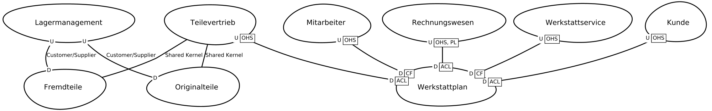

[[section-system-scope-and-context]]
== (System-) Kontextabgrenzung

Das folgende Diagramm zeigt das Softwaresystem Werkstatt und seinen Systemkontext bestehend aus den Nutzern des Softwaresystems, der eigenen Datenbank und Nachbarsysteme names Mitarbeiter und Originalteile.

[plantuml,target=system-context,format=png]
....

actor "Werkstattmeister:in" as meister
actor "Serviceberater:in" as berater
actor "Werkstattmitarbeiter:in" as mitarbeiter

component Werkstatt <<subdomain>>

node Mitarbeiter <<bounded context>>
node Orignalteile <<boundded context>>

database WerkstattDB

Werkstatt --> WerkstattDB
Werkstatt --> Mitarbeiter

meister --> Werkstatt
berater --> Werkstatt
mitarbeiter --> Werkstatt
Orignalteile -- Werkstatt

....

Die Subdomäne Werkstatt wird als modularer Monolith realisiert.
Die Bausteinsicht dokumentiert die Dekomposition des Monolithen anhand von Bounded Contexts und Aggregates.

== Context Map Autohaus

Die Context Map zeigt die Bounded Contexts des Autohaus und gibt einen Überblick über die gesamte Domäne Autohaus und setzt die Subdomäne Werkstatt mit den Bounded Contexts Werkstattplanung und Werkstattservice in das sozio-technische Gesamtbild.

